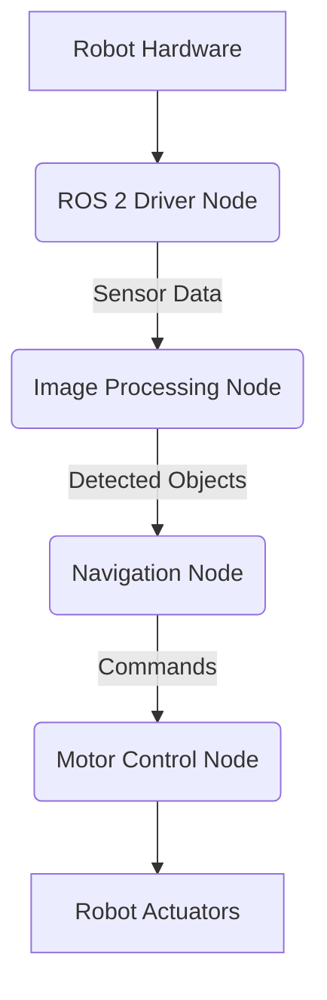

# Chapter 1.1 - Introduction to ROS 2

## Introduction

Welcome to the world of ROS 2, the powerful and flexible framework for robotics development. In this chapter, we will embark on a journey to understand the fundamentals of ROS 2, its architecture, and why it has become an indispensable tool for engineers and researchers building complex robotic systems.

## Concepts

ROS 2 (Robot Operating System 2) is a set of software libraries and tools that help you build robot applications. From drivers to state-of-the-art algorithms, and with powerful developer tools, ROS has everything you need for your next robotics project.

### Why ROS 2?

ROS 2 addresses many limitations of its predecessor, ROS 1, particularly concerning multi-robot systems, real-time control, and security. It leverages industry standards like DDS (Data Distribution Service) for robust inter-process communication.

### ROS 2 Architecture

At its core, ROS 2 is a distributed system where various independent programs, called **nodes**, communicate with each other. This communication happens through mechanisms like **topics**, **services**, and **actions**.



### Core Concepts: Nodes, Topics, Services, Actions, Parameters

*   **Nodes**: Executable processes that perform computation (e.g., a camera driver, a motor controller).
*   **Topics**: A publish/subscribe communication mechanism for streaming data (e.g., sensor readings, velocity commands).
*   **Services**: A request/reply communication mechanism for synchronous calls (e.g., "capture image", "reset robot").
*   **Actions**: A long-running goal-oriented communication for complex tasks (e.g., "navigate to a location").
*   **Parameters**: Dynamic configurable values for nodes (e.g., motor speed limit).

## Implementation

For this introductory chapter, we will focus on understanding the concepts rather than extensive coding. A simple "hello world" equivalent in ROS 2 involves running a publisher and subscriber node.

```bash
# Example: Running a simple talker-listener in ROS 2
# In Terminal 1:
# source /opt/ros/humble/setup.bash
# ros2 run demo_nodes_cpp talker

# In Terminal 2:
# source /opt/ros/humble/setup.bash
# ros2 run demo_nodes_py listener
```

## Exercises

### Exercise 1: Exploring ROS 2 Commands

Open a terminal and source your ROS 2 environment. Experiment with the following commands to get a feel for the system:
*   `ros2 node list`
*   `ros2 topic list`
*   `ros2 service list`
*   `ros2 param list`

## Summary

In this chapter, we introduced ROS 2, its architectural components, and core communication concepts. We learned about nodes, topics, services, actions, and parameters. This foundational understanding is crucial for building more complex robotic behaviors.

---
#### Further Resources:
- [ROS 2 Documentation - Concepts](https://docs.ros.org/en/humble/Concepts.html)
- [ROS 2 Foxy vs Humble: Key Differences](https://roboticsbackend.com/ros2-foxy-vs-humble/)
