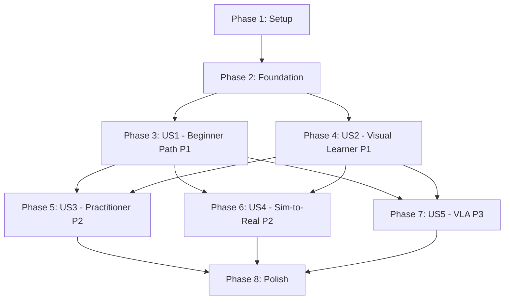

# Tasks: Physical AI & Humanoid Robotics Textbook

**Input**: Design documents from `/specs/physical-ai-textbook/`
**Prerequisites**: plan.md (complete), spec.md (complete)

**Tests**: Not requested in specification - focus on content creation and build verification

**Organization**: Tasks are grouped by user story priority to enable incremental delivery. Each user story phase delivers a complete, independently valuable module.

## Format: `[ID] [P?] [Story] Description`

- **[P]**: Can run in parallel (different files, no dependencies)
- **[Story]**: Which user story this task belongs to (US1, US2, US3, US4, US5)
- Include exact file paths in descriptions

## Path Conventions

- **Docusaurus structure**: `docs/`, `src/`, `static/` at repository root
- **Module directories**: `docs/module-01-ros2/`, `docs/module-02-digital-twin/`, etc.
- **Configuration**: Root-level `.ts` and `.json` files

---

## Phase 1: Setup (Project Infrastructure)

**Purpose**: Prepare Docusaurus for content creation

- [ ] T001 Install @docusaurus/theme-mermaid package via npm
- [ ] T002 [P] Update docusaurus.config.ts to enable Mermaid theme
- [ ] T003 [P] Update docusaurus.config.ts to add Python/YAML/XML to Prism languages
- [ ] T004 Delete docs/tutorial-basics/ directory (default demo content)
- [ ] T005 Delete docs/tutorial-extras/ directory (default demo content)
- [ ] T006 [P] Create docs/module-01-ros2/ directory
- [ ] T007 [P] Create docs/module-02-digital-twin/ directory
- [ ] T008 [P] Create docs/module-03-ai-brain/ directory
- [ ] T009 [P] Create docs/module-04-vla/ directory
- [ ] T010 [P] Create docs/module-05-capstone/ directory

---

## Phase 2: Foundational (Sidebar & Navigation)

**Purpose**: Configure navigation structure for all modules

**⚠️ CRITICAL**: Complete before content creation to ensure proper routing

- [ ] T011 Create docs/module-01-ros2/_category_.json with label "🤖 Module 1: The Robotic Nervous System (ROS 2)"
- [ ] T012 [P] Create docs/module-02-digital-twin/_category_.json with label "🎮 Module 2: The Digital Twin (Simulation)"
- [ ] T013 [P] Create docs/module-03-ai-brain/_category_.json with label "🧠 Module 3: The AI-Robot Brain (Isaac Sim & Nav2)"
- [ ] T014 [P] Create docs/module-04-vla/_category_.json with label "💬 Module 4: Vision-Language-Action (VLA)"
- [ ] T015 [P] Create docs/module-05-capstone/_category_.json with label "⚡ Capstone Project: The Autonomous Humanoid"
- [ ] T016 Update sidebars.ts with manual sidebar configuration for all 5 modules

**Checkpoint**: Sidebar structure complete - module content can now be created in parallel

---

## Phase 3: User Story 1 - Complete Beginner Learning Path (Priority: P1) 🎯 MVP

**Goal**: Enable a beginner to complete Module 1, write their first ROS 2 node, and see a simulated robot respond to code within 3 hours

**Independent Test**: A beginner with Python can navigate to Module 1, read biological analogy chapter, copy/paste the talker node code, run it, and see output in terminal

**Success Criteria**:
- ✅ Learner understands ROS 2 architecture via biological analogies
- ✅ Learner can write and run a publisher node
- ✅ Learner can define and visualize a URDF file
- ✅ All code examples are runnable and include "How to run" instructions

### Content: Module 1 (The Robotic Nervous System - ROS 2)

- [ ] T017 [P] [US1] Write docs/intro.md (textbook preface with course overview, learning path, co-learning tone)
- [ ] T018 [P] [US1] Write docs/module-01-ros2/01-biological-analogy.md (ROS 2 concepts via nervous system, 1 Mermaid diagram: nervous system → ROS 2 mapping)
- [ ] T019 [P] [US1] Write docs/module-01-ros2/02-first-node.md (talker/listener nodes, 2 Mermaid diagrams: node graph, message flow; 2 code examples: talker.py, listener.py)
- [ ] T020 [P] [US1] Write docs/module-01-ros2/03-services-actions.md (request/response vs long-running goals, 2 Mermaid diagrams: service sequence, action feedback; 2 code examples: service server, action server)
- [ ] T021 [P] [US1] Write docs/module-01-ros2/04-urdf-basics.md (robot geometry, link-joint tree, 1 Mermaid diagram: URDF tree; 1 code example: simple mobile robot URDF)
- [ ] T022 [P] [US1] Write docs/module-01-ros2/05-coordinate-frames.md (TF transforms, spatial relationships, 1 Mermaid diagram: TF tree example; 1 code example: static transform broadcaster)

**Checkpoint**: Module 1 complete - beginners can learn ROS 2 fundamentals and write their first nodes

**Deliverable**: 6 files (1 intro + 5 chapters), 6 Mermaid diagrams, 7 code examples

---

## Phase 4: User Story 2 - Visual Learner Experience (Priority: P1)

**Goal**: Provide Mermaid.js diagrams for every technical concept across all modules so visual learners can understand architecture without reading text

**Independent Test**: Every technical concept (ROS 2 message flow, SLAM loop, VLA pipeline, etc.) has an accompanying diagram that can be understood independently

**Success Criteria**:
- ✅ 30+ Mermaid diagrams across all content
- ✅ Each diagram has explanatory caption
- ✅ Diagrams cover architecture, data flow, and system interactions
- ✅ Diagrams render correctly in dark mode (cyber-physical theme)

### Content: Modules 2, 3, 4, 5 with Visual Focus

#### Module 2: The Digital Twin (Simulation)

- [ ] T023 [P] [US2] Write docs/module-02-digital-twin/01-why-simulate.md (sim-to-real justification, 1 Mermaid diagram: sim-to-real pipeline)
- [ ] T024 [P] [US2] Write docs/module-02-digital-twin/02-gazebo-fundamentals.md (world files, physics, 2 Mermaid diagrams: Gazebo architecture, sensor plugins; 2 code examples: launch file, world file)
- [ ] T025 [P] [US2] Write docs/module-02-digital-twin/03-physics-sensors.md (LiDAR, IMU, RGB-D, 1 Mermaid diagram: sensor data flow; 1 code example: SDF sensor plugin)
- [ ] T026 [P] [US2] Write docs/module-02-digital-twin/04-unity-hri.md (Unity-ROS integration, 1 Mermaid diagram: Unity-ROS bridge; 1 code example: Unity C# ROS subscriber)
- [ ] T027 [P] [US2] Write docs/module-02-digital-twin/05-sim-to-real.md (transfer checklist, domain randomization, 1 Mermaid diagram: validation workflow; 1 code example: randomization script)

#### Module 3: The AI-Robot Brain (Isaac Sim & Nav2)

- [ ] T028 [P] [US2] Write docs/module-03-ai-brain/01-isaac-sim-intro.md (setup, system requirements, 1 Mermaid diagram: Isaac Sim architecture; 1 code example: robot spawn script)
- [ ] T029 [P] [US2] Write docs/module-03-ai-brain/02-synthetic-data.md (Replicator API, dataset generation, 1 Mermaid diagram: synthetic data pipeline; 1 code example: Replicator script)
- [ ] T030 [P] [US2] Write docs/module-03-ai-brain/03-nav2-architecture.md (costmaps, planners, controllers, 3 Mermaid diagrams: Nav2 stack, costmap layers, behavior tree; 1 code example: Nav2 config YAML)
- [ ] T031 [P] [US2] Write docs/module-03-ai-brain/04-slam-mapping.md (slam_toolbox, loop closure, 2 Mermaid diagrams: SLAM loop, pose graph; 1 code example: slam_toolbox launch file)
- [ ] T032 [P] [US2] Write docs/module-03-ai-brain/05-path-planning.md (A*, RRT*, DWB comparison, 1 Mermaid diagram: planner comparison flowchart; 1 code example: planner benchmark script)

#### Module 4: Vision-Language-Action (VLA)

- [ ] T033 [P] [US2] Write docs/module-04-vla/01-vla-revolution.md (conceptual intro, RT-2, PaLM-E, 1 Mermaid diagram: full VLA pipeline)
- [ ] T034 [P] [US2] Write docs/module-04-vla/02-voice-whisper.md (OpenAI Whisper, audio capture, 1 Mermaid diagram: ASR workflow; 1 code example: Whisper transcription script)
- [ ] T035 [P] [US2] Write docs/module-04-vla/03-llm-parsing.md (GPT-4/Gemini, prompt engineering, 1 Mermaid diagram: LLM prompt → JSON; 1 code example: OpenAI API parser)
- [ ] T036 [P] [US2] Write docs/module-04-vla/04-action-servers.md (ROS 2 actions, custom definitions, 2 Mermaid diagrams: action lifecycle, client-server; 1 code example: navigation action server)
- [ ] T037 [P] [US2] Write docs/module-04-vla/05-safety-validation.md (whitelisting, bounds checking, 1 Mermaid diagram: validation layer; 1 code example: command validator)

#### Capstone Project

- [ ] T038 [P] [US2] Write docs/module-05-capstone/01-project-overview.md (requirements, system architecture, 2 Mermaid diagrams: full integration, state machine)
- [ ] T039 [P] [US2] Write docs/module-05-capstone/02-integration-guide.md (step-by-step integration, 1 Mermaid diagram: data flow voice→motion; 1 code example: main integration launch file)
- [ ] T040 [P] [US2] Write docs/module-05-capstone/03-rubric-assessment.md (self-assessment rubric, deployment checklist, 1 Mermaid diagram: deployment workflow; 1 code example: Docker Compose)

**Checkpoint**: All modules complete with comprehensive visual diagrams

**Deliverable**: 18 files (Modules 2-5), 24+ Mermaid diagrams, 13+ code examples

---

## Phase 5: User Story 3 - Hands-On Practitioner Path (Priority: P2)

**Goal**: Provide production-ready, runnable Python code snippets that follow ROS 2 conventions and can be integrated into real systems

**Independent Test**: A developer can copy any code snippet, run it in ROS 2 Humble environment, and it executes without modification

**Success Criteria**:
- ✅ All Python code includes type hints
- ✅ All code follows ROS 2 naming conventions
- ✅ Each snippet has "How to run" and "Expected output" sections
- ✅ Code includes error handling where appropriate
- ✅ Inline comments explain logic every 3-5 lines

### Code Quality & Documentation

- [ ] T041 [P] [US3] Review all Module 1 code examples (T019-T022) for type hints and inline comments
- [ ] T042 [P] [US3] Add "Try it yourself" suggestions to all Module 1 chapters
- [ ] T043 [P] [US3] Review all Module 2 code examples (T024-T027) for production-readiness
- [ ] T044 [P] [US3] Add "Common Pitfalls" sections to Module 2 chapters
- [ ] T045 [P] [US3] Review all Module 3 code examples (T028-T032) for Nav2 best practices
- [ ] T046 [P] [US3] Add error handling examples to Module 3 navigation code
- [ ] T047 [P] [US3] Review all Module 4 code examples (T034-T037) for LLM integration patterns
- [ ] T048 [P] [US3] Add safety validation patterns to Module 4 VLA code
- [ ] T049 [P] [US3] Review capstone code examples (T039-T040) for Docker/deployment best practices
- [ ] T050 [P] [US3] Add hands-on exercises with acceptance criteria to all 20 chapters

**Checkpoint**: All code examples are production-quality and practitioner-ready

**Deliverable**: Enhanced code quality across 20+ examples, 20 hands-on exercises

---

## Phase 6: User Story 4 - Concept-to-Real Transfer (Priority: P2)

**Goal**: Provide explicit sim-to-real techniques so learners can bridge the gap between Gazebo/Isaac Sim and physical robots

**Independent Test**: Module 2-3 provide specific techniques (domain randomization, sensor noise, PID tuning) with before/after comparisons

**Success Criteria**:
- ✅ Module 2 includes sim-to-real transfer checklist
- ✅ Domain randomization techniques documented with code
- ✅ Sensor noise modeling explained with parameters
- ✅ Isaac Sim synthetic data workflow validated
- ✅ Nav2 parameter tuning guide included

### Sim-to-Real Content Enhancement

- [ ] T051 [P] [US4] Expand docs/module-02-digital-twin/05-sim-to-real.md with troubleshooting guide (friction, inertia, damping tuning)
- [ ] T052 [P] [US4] Add physics parameter comparison table (sim vs real) to Module 2
- [ ] T053 [P] [US4] Expand docs/module-03-ai-brain/02-synthetic-data.md with domain randomization best practices
- [ ] T054 [P] [US4] Add sensor validation section to Module 2 comparing simulated vs real LiDAR/camera data
- [ ] T055 [P] [US4] Add PID parameter transfer guide to Module 3 Nav2 chapters
- [ ] T056 [P] [US4] Create alternative path documentation for non-GPU learners (Gazebo-only workflow) in docs/intro.md

**Checkpoint**: Sim-to-real gap explicitly addressed with actionable techniques

**Deliverable**: Enhanced Module 2-3 content with transfer techniques, alternative paths

---

## Phase 7: User Story 5 - Natural Language Robot Control (Priority: P3)

**Goal**: Provide complete VLA pipeline (Whisper → LLM → ROS 2 actions) that enables natural language robot control

**Independent Test**: Module 4 provides runnable VLA stack where speaking "move forward 2 meters" executes robot motion

**Success Criteria**:
- ✅ Voice capture with Whisper demonstrated
- ✅ LLM command parsing (GPT-4/Gemini) with examples
- ✅ ROS 2 action server integration shown
- ✅ Safety validation layer implemented
- ✅ Full pipeline integrated in capstone

### VLA Integration & Capstone Completion

- [ ] T057 [P] [US5] Add multi-step command examples to docs/module-04-vla/03-llm-parsing.md (e.g., "go to table and pick up cup")
- [ ] T058 [P] [US5] Add prompt engineering templates for robotics to Module 4
- [ ] T059 [P] [US5] Expand docs/module-05-capstone/02-integration-guide.md with VLA troubleshooting (transcription errors, invalid commands)
- [ ] T060 [P] [US5] Add state machine implementation guide to capstone (Listening → Planning → Executing → Done)
- [ ] T061 [P] [US5] Create complete requirements.txt for VLA dependencies (Whisper, OpenAI SDK, ROS 2 packages)
- [ ] T062 [P] [US5] Add environment variable setup guide (.env file) for API keys in capstone

**Checkpoint**: VLA pipeline complete with safety and error handling

**Deliverable**: Enhanced Module 4, complete capstone integration, dependency management

---

## Phase 8: Polish & Cross-Cutting Concerns

**Purpose**: Final touches for production-ready textbook

### Assets & Branding

- [ ] T063 [P] Create or update static/img/logo.svg (robot/AI-themed logo with cyber-physical aesthetic)
- [ ] T064 [P] Update static/img/favicon.ico (robot icon for browser tab)
- [ ] T065 [P] Create static/img/social-card.jpg (preview image for social media with course title and branding)

### Configuration & Meta Content

- [ ] T066 [P] Add meta descriptions to all 23 content files (intro + 20 chapters + 3 capstone) for SEO
- [ ] T067 [P] Add "Further Reading" sections to all chapters with external links (ROS 2 docs, Nav2, Isaac Sim)
- [ ] T068 [P] Create glossary section in docs/intro.md with 50+ robotics terms (URDF, TF, SLAM, costmap, etc.)
- [ ] T069 [P] Add "Prerequisites" section to docs/intro.md (Python, command-line, Git, system requirements)
- [ ] T070 [P] Add quick start setup guide to docs/intro.md (Ubuntu 22.04, ROS 2 Humble install, Docker alternative)

### Build Verification

- [ ] T071 Run npm install to verify all dependencies resolve
- [ ] T072 Run npm run build to verify production build succeeds
- [ ] T073 [P] Test all 30+ Mermaid diagrams render correctly in dark mode
- [ ] T074 [P] Verify all Python code blocks have syntax highlighting
- [ ] T075 [P] Test sidebar navigation (collapse/expand categories)
- [ ] T076 [P] Test mobile responsiveness on viewport <768px
- [ ] T077 Run npm run serve and manually verify landing page, Module 1, and capstone pages

### Link & Content Validation

- [ ] T078 [P] Verify all internal links between chapters resolve correctly
- [ ] T079 [P] Check all "Next Steps" links at end of chapters point to correct next chapter
- [ ] T080 [P] Validate all external links (ROS 2 docs, GitHub repos) are accessible
- [ ] T081 [P] Proofread all content for typos and formatting consistency
- [ ] T082 [P] Verify code examples use consistent style (import order, spacing, comments)

**Checkpoint**: Textbook is production-ready for deployment

---

## Dependencies & Execution Strategy

### User Story Dependencies (Completion Order)

### Parallelization Opportunities

**Phase 3 (US1 - Module 1 Content)**: All 6 content files (T017-T022) can be written in parallel - different files, no dependencies

**Phase 4 (US2 - Modules 2-5 Content)**: All 18 content files (T023-T040) can be written in parallel - different modules, no dependencies

**Phase 5 (US3 - Code Quality)**: All 10 review tasks (T041-T050) can be done in parallel - each reviews different module

**Phase 6 (US4 - Sim-to-Real)**: All 6 enhancement tasks (T051-T056) can be done in parallel - different chapters

**Phase 7 (US5 - VLA)**: All 6 tasks (T057-T062) can be done in parallel - different files

**Phase 8 (Polish)**: Assets (T063-T065), meta content (T066-T070), and link validation (T078-T082) can run in parallel

### MVP Scope (Minimum Viable Product)

**Recommended MVP**: Complete Phase 1-3 only (Setup + Foundation + US1)

**MVP Deliverable**:
- ✅ Working Docusaurus site with navigation
- ✅ Complete Module 1 (5 chapters)
- ✅ Beginner can learn ROS 2 and write first node
- ✅ 6 Mermaid diagrams
- ✅ 7 runnable code examples
- ✅ Cyber-physical theme applied

**Estimated MVP Tasks**: 22 tasks (T001-T022)

**Post-MVP Increments**:
- **Increment 2**: Add US2 (Modules 2-5 with diagrams) - 18 tasks
- **Increment 3**: Add US3 (code quality) - 10 tasks
- **Increment 4**: Add US4 (sim-to-real) - 6 tasks
- **Increment 5**: Add US5 (VLA) - 6 tasks
- **Increment 6**: Polish - 20 tasks

---

## Summary

**Total Tasks**: 82
**Breakdown**:
- Setup: 10 tasks
- Foundation: 6 tasks
- US1 (P1 - Beginner Path): 6 tasks
- US2 (P1 - Visual Learner): 18 tasks
- US3 (P2 - Practitioner): 10 tasks
- US4 (P2 - Sim-to-Real): 6 tasks
- US5 (P3 - VLA): 6 tasks
- Polish: 20 tasks

**Parallelizable Tasks**: 68 tasks marked with [P]

**Independent Test Criteria**:
- ✅ US1: Beginner completes Module 1 in 3 hours, runs first node
- ✅ US2: Every concept has Mermaid diagram understandable alone
- ✅ US3: All code runs without modification in ROS 2 Humble
- ✅ US4: Sim-to-real techniques validated with before/after
- ✅ US5: VLA pipeline executes voice commands

**Suggested MVP**: Phases 1-3 (22 tasks) - delivers Module 1 for beginners

---

## Format Validation ✅

All tasks follow required format:
- ✅ Checkbox prefix: `- [ ]`
- ✅ Task ID: Sequential (T001-T082)
- ✅ [P] marker: Present on 68 parallelizable tasks
- ✅ [Story] label: Present on user story tasks (US1-US5)
- ✅ File paths: Included in all content creation tasks
- ✅ Clear descriptions: Actionable and specific

**Status**: Tasks file ready for implementation ✅
