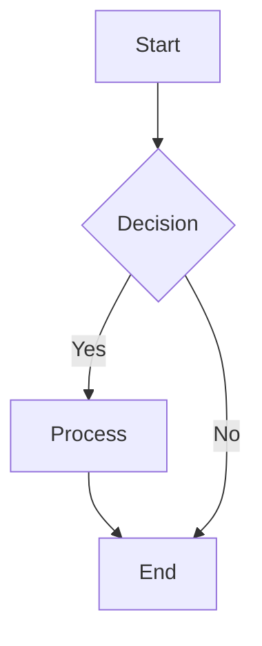

# [CHAPTER TITLE]

## Introduction

[Briefly introduce the chapter topic and its objectives. (~200 words)]

## Concepts

[Explain core theories, concepts, and principles relevant to the chapter. Use clear language, examples, and Mermaid diagrams where helpful. (~1000 words)]



## Implementation

[Provide step-by-step instructions and code examples. Each code block should have a clear purpose and explanation. Ensure all code is testable and functional. (~800 words)]

```python
# code/moduleX/chapterX/example.py
def hello_robot():
    print("Hello, Robot!")

if __name__ == "__main__":
    hello_robot()
```

## Exercises

[Offer hands-on practice problems. Each exercise should have a clear goal and potentially a hint or a pointer to a solution. (~400 words)]

### Exercise 1: [EXERCISE TITLE]

[Description of the exercise. What should the reader achieve?]

## Summary

[Recap the key takeaways and reinforce the main learning points of the chapter. (~150 words)]

---
#### Further Resources:
- [Link to external documentation or relevant articles]
